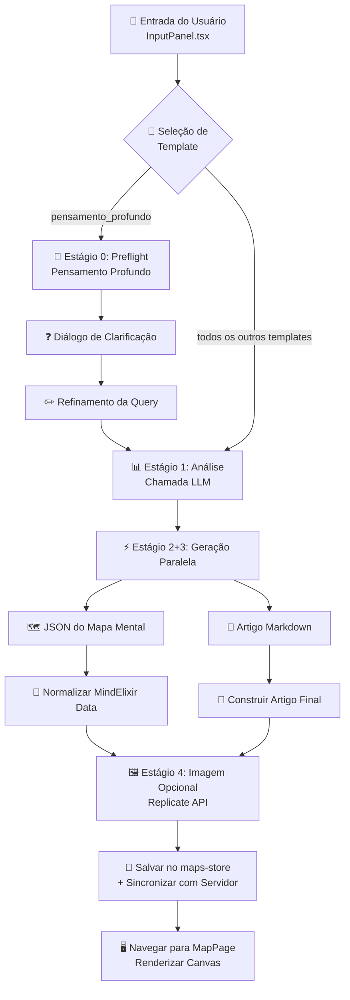
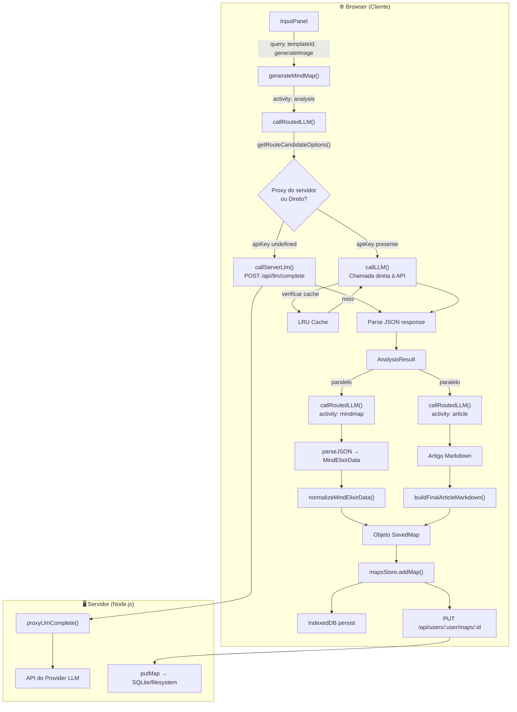
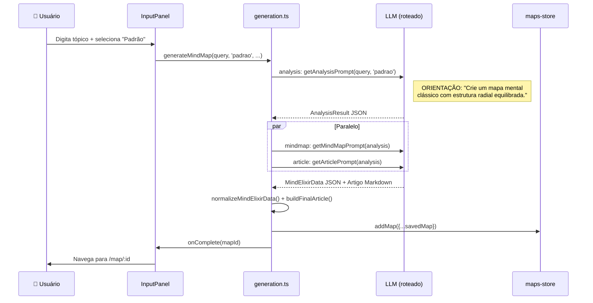
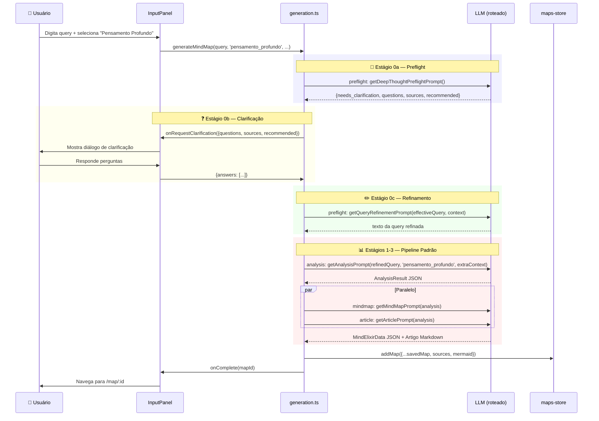
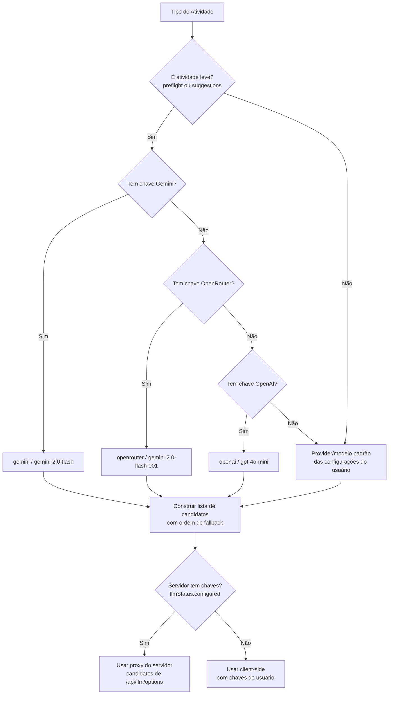
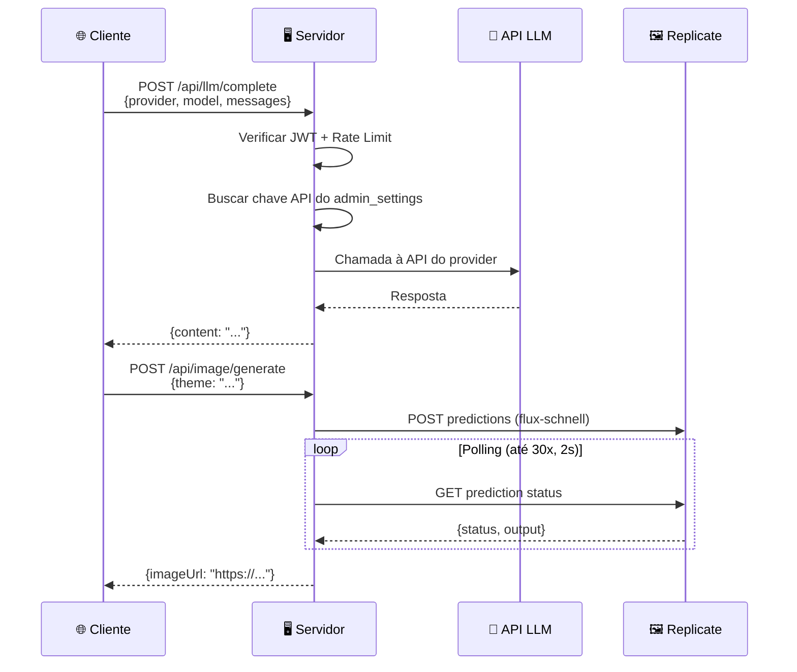
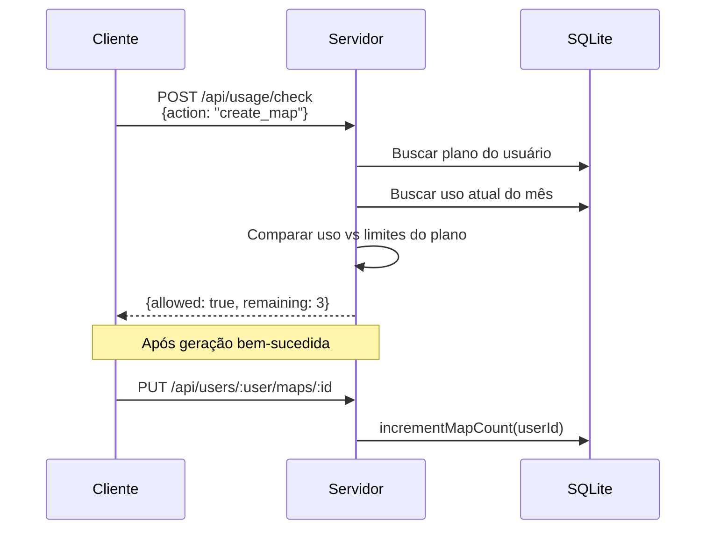
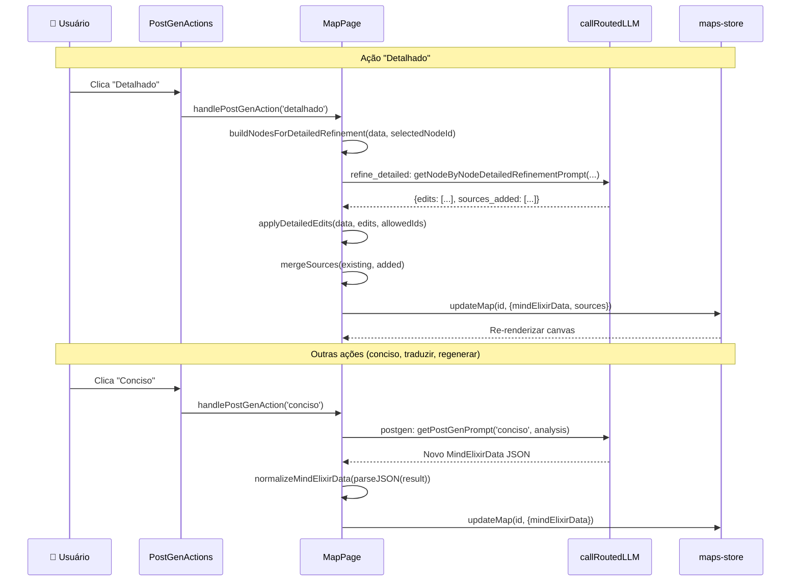
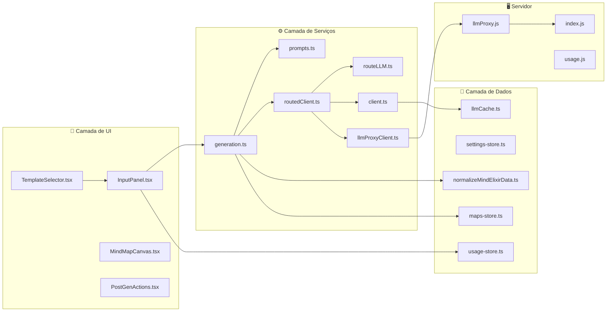

# 📋 Templates — Documentação Completa do Sistema de Geração

> Documentação técnica detalhada de todos os templates disponíveis no **3MAPS**, incluindo fluxos de geração, prompts LLM, APIs externas e artefatos envolvidos.

---

## 📑 Índice

1. [Visão Geral da Arquitetura](#1-visão-geral-da-arquitetura)
2. [Pipeline Geral de Geração](#2-pipeline-geral-de-geração)
3. [Definição dos Templates](#3-definição-dos-templates)
4. [Detalhamento por Template](#4-detalhamento-por-template)
   - 4.1 [Padrão](#41-padrão)
   - 4.2 [Brainstorm](#42-brainstorm)
   - 4.3 [Análise](#43-análise)
   - 4.4 [Projeto](#44-projeto)
   - 4.5 [Estudo](#45-estudo)
   - 4.6 [Problema](#46-problema)
   - 4.7 [Comparação](#47-comparação)
   - 4.8 [Linha do Tempo](#48-linha-do-tempo)
   - 4.9 [Pensamento Profundo](#49-pensamento-profundo)
5. [Sistema de Roteamento LLM](#5-sistema-de-roteamento-llm)
6. [APIs e Serviços Externos](#6-apis-e-serviços-externos)
7. [Sistema de Cache](#7-sistema-de-cache)
8. [Proxy do Servidor](#8-proxy-do-servidor)
9. [Rate Limiting e Controle de Uso](#9-rate-limiting-e-controle-de-uso)
10. [Controle de Acesso por Plano](#10-controle-de-acesso-por-plano)
11. [Ações Pós-Geração](#11-ações-pós-geração)
12. [Parsing e Recuperação de JSON](#12-parsing-e-recuperação-de-json)
13. [Artefatos e Arquivos-Chave](#13-artefatos-e-arquivos-chave)

---

## 1. Visão Geral da Arquitetura

O sistema de geração do 3MAPS segue uma arquitetura de pipeline multi-estágio onde a entrada do usuário flui por: seleção de template → análise via LLM → geração paralela de mapa mental + artigo → geração opcional de imagem → persistência e renderização.



### Arquivos-Chave do Sistema

| Arquivo | Função |
|---------|--------|
| [`src/components/generation/InputPanel.tsx`](src/components/generation/InputPanel.tsx) | UI de entrada do usuário + seleção de template |
| [`src/components/generation/TemplateSelector.tsx`](src/components/generation/TemplateSelector.tsx) | Grid de templates com controle por plano |
| [`src/lib/constants.ts`](src/lib/constants.ts) | Definições dos templates (array `TEMPLATES`) |
| [`src/services/llm/prompts.ts`](src/services/llm/prompts.ts) | Todas as funções de prompt LLM |
| [`src/services/llm/generation.ts`](src/services/llm/generation.ts) | Orquestrador principal `generateMindMap()` |
| [`src/services/llm/routeLLM.ts`](src/services/llm/routeLLM.ts) | Roteamento de provider/modelo baseado em atividade |
| [`src/services/llm/routedClient.ts`](src/services/llm/routedClient.ts) | Cliente LLM roteado com fallback |
| [`src/services/llm/client.ts`](src/services/llm/client.ts) | Chamadas diretas à API LLM + parser JSON |
| [`src/services/llm/llmProxyClient.ts`](src/services/llm/llmProxyClient.ts) | Cliente do proxy do servidor |
| [`server/llmProxy.js`](server/llmProxy.js) | Proxy LLM no servidor |
| [`src/lib/llmCache.ts`](src/lib/llmCache.ts) | Cache LRU em memória |
| [`src/pages/MapPage.tsx`](src/pages/MapPage.tsx) | Ações pós-geração + renderização |

---

## 2. Pipeline Geral de Geração

Definido em [`generateMindMap()`](src/services/llm/generation.ts). Todos os templates (exceto `pensamento_profundo`) compartilham o mesmo pipeline de 4 estágios.

### Pré-verificações

1. **Verificação de chave API:** `settings.hasAnyApiKey()` — verifica se o servidor tem chaves LLM configuradas
2. **Verificação de limite de uso:** `usageStore.checkAction('create_map')` — chama `POST /api/usage/check`

### Estágio 1: Análise

| Propriedade | Valor |
|-------------|-------|
| **Atividade** | `analysis` |
| **Função de Prompt** | `getAnalysisPrompt()` |
| **Temperatura** | 0.3 |
| **Max Tokens** | 4096 |

**Prompt de Análise** (compartilhado por todos os templates):

```
Você é um especialista em análise conceptual e criação de mapas mentais.

Avalie a pergunta/tópico: se estiver vago, amplo ou ambíguo, interprete de forma
mais precisa e estruturada antes de prosseguir.
Responda de forma direta, sem redundâncias, com estrutura clara. Evite tom
jornalístico ou decorativo.

TÓPICO: {topic}
ORIENTAÇÃO DO TEMPLATE: {promptModifier do template selecionado}

Analise o tópico acima e retorne um JSON com a seguinte estrutura:
{
  "central_theme": "tema central identificado",
  "subtopics": ["subtópico 1", "subtópico 2", ...],
  "key_concepts": ["conceito 1", "conceito 2", ...],
  "relationships": [{"from": "A", "to": "B", "type": "causa/efeito/..."}],
  "depth_level": 3,
  "suggested_node_count": 25,
  "suggested_tags": ["tag1", "tag2"],
  "template_context": "templateId"
}
```

**Formato de saída esperado** (`AnalysisResult`):

```json
{
  "central_theme": "string",
  "subtopics": ["string"],
  "key_concepts": ["string"],
  "relationships": [{"from": "string", "to": "string", "type": "string"}],
  "depth_level": 3,
  "suggested_node_count": 25,
  "suggested_tags": ["string"],
  "template_context": "templateId"
}
```

### Estágio 2: Geração do Mapa Mental (paralelo)

| Propriedade | Valor |
|-------------|-------|
| **Atividade** | `mindmap` |
| **Função de Prompt** | `getMindMapPrompt()` |
| **Temperatura** | 0.4 |
| **Max Tokens** | 8000 |

**Prompt do Mapa Mental:**

```
Com base na análise abaixo, gere um mapa mental em formato JSON compatível
com MindElixir.

REGRAS OBRIGATÓRIAS:
- O id do nó raiz DEVE ser "root"
- IDs dos nós: formato "node_N" ou "node_N_N"
- Tópicos: máximo 50 caracteres
- Um ramo por subtópico, 2–5 sub-nós por ramo
- Idioma: Português Brasileiro
- Sem campos extras (direction, theme, style, etc.)

ANÁLISE:
{analysisResult em JSON}

Retorne APENAS JSON válido:
{
  "nodeData": {
    "id": "root",
    "topic": "Tema Central",
    "children": [
      {
        "id": "node_1",
        "topic": "Subtópico 1",
        "children": [
          {"id": "node_1_1", "topic": "Detalhe 1.1", "children": [
            {"id": "node_1_1_1", "topic": "Sub-detalhe"}
          ]},
          {"id": "node_1_2", "topic": "Detalhe 1.2"}
        ]
      }
    ]
  }
}
```

### Estágio 3: Geração do Artigo (paralelo com Estágio 2)

| Propriedade | Valor |
|-------------|-------|
| **Atividade** | `article` |
| **Função de Prompt** | `getArticlePrompt()` |
| **Temperatura** | 0.7 |
| **Max Tokens** | 4000 |

**Prompt do Artigo:**

```
Com base na análise abaixo, escreva um artigo educativo em Markdown.

ESTRUTURA:
- H1 com o título (deve corresponder ao central_theme)
- Uma seção ## por subtópico
- ### para conceitos-chave
- Listas com bullets
- Marcadores opcionais: ✅ ⚠️ 📌 🔹
- Mínimo ~800 palavras

ANÁLISE:
{analysisResult em JSON}
```

### Estágio 4: Geração de Imagem (opcional)

| Propriedade | Valor |
|-------------|-------|
| **API** | Replicate (`black-forest-labs/flux-schnell`) |
| **Endpoint** | `POST /api/image/generate` |
| **Resolução** | 1024×576 |
| **Polling** | Até 30 tentativas, intervalo de 2s |

**Prompt da Imagem:**

```
A beautiful, detailed illustration representing the concept of "{theme}".
Digital art, vibrant colors, professional quality.
```

### Pós-Processamento

1. **Normalização do mapa:** [`normalizeMindElixirData()`](src/lib/normalizeMindElixirData.ts) — garante que cada nó tenha `{id, topic, children}`, desduplicação de IDs, distribui filhos raiz alternando LEFT/RIGHT
2. **Finalização do artigo:** [`buildFinalArticleMarkdown()`](src/services/llm/generation.ts) — garante título H1, insere imagem de capa após H1
3. **Persistência:** Cria objeto `SavedMap` e chama `mapsStore.addMap()` → IndexedDB + `PUT /api/users/:user/maps/:id`

### Diagrama de Fluxo Completo



---

## 3. Definição dos Templates

Definidos em [`src/lib/constants.ts`](src/lib/constants.ts) como o array `TEMPLATES`. O sistema de tipos está em [`src/types/mindmap.ts`](src/types/mindmap.ts).

### Tipo TypeScript

```typescript
export type TemplateId =
  | 'padrao'
  | 'brainstorm'
  | 'analise'
  | 'projeto'
  | 'estudo'
  | 'problema'
  | 'comparacao'
  | 'timeline'
  | 'pensamento_profundo';

export interface Template {
  id: TemplateId;
  name: string;
  description: string;
  icon: string;
  promptModifier: string;
  color: string;
  structure: 'radial' | 'linear' | 'hierarchical' | 'timeline';
}
```

### Tabela Resumo de Todos os Templates

| # | ID | Nome | Ícone | Cor | Estrutura | Plano Mínimo |
|---|-----|------|-------|-----|-----------|--------------|
| 1 | `padrao` | Padrão | 🗺️ | blue | radial | Free |
| 2 | `brainstorm` | Brainstorm | 💡 | yellow | radial | Free |
| 3 | `analise` | Análise | 🔍 | purple | hierarchical | Free |
| 4 | `projeto` | Projeto | 📋 | green | hierarchical | Premium |
| 5 | `estudo` | Estudo | 📚 | teal | hierarchical | Premium |
| 6 | `problema` | Problema | ⚡ | red | hierarchical | Premium |
| 7 | `comparacao` | Comparação | ⚖️ | orange | radial | Premium |
| 8 | `timeline` | Linha do Tempo | 📅 | indigo | timeline | Premium |
| 9 | `pensamento_profundo` | Pensamento Profundo | 🧠 | slate | hierarchical | Premium |

---

## 4. Detalhamento por Template

### 4.1 Padrão

| Propriedade | Valor |
|-------------|-------|
| **ID** | `padrao` |
| **Nome** | Padrão |
| **Ícone** | 🗺️ |
| **Cor** | blue |
| **Estrutura** | radial |
| **Plano** | Free |

**Descrição:** Mapa mental clássico com estrutura radial equilibrada.

**`promptModifier`:**
```
Crie um mapa mental clássico com estrutura radial equilibrada.
```

**Fluxo de Geração:**



**Características:**
- Estrutura radial com nó central e ramos equilibrados
- Distribuição LEFT/RIGHT automática dos ramos
- Ideal para visão geral de qualquer tópico
- Template padrão selecionado por default

---

### 4.2 Brainstorm

| Propriedade | Valor |
|-------------|-------|
| **ID** | `brainstorm` |
| **Nome** | Brainstorm |
| **Ícone** | 💡 |
| **Cor** | yellow |
| **Estrutura** | radial |
| **Plano** | Free |

**Descrição:** Exploração livre de ideias e conexões.

**`promptModifier`:**
```
Crie um mapa de brainstorming com foco em geração criativa de ideias,
conexões inesperadas e associações livres.
```

**Fluxo de Geração:** Idêntico ao pipeline padrão (Estágios 1→2+3→4).

**Características:**
- Foco em criatividade e associações livres
- Conexões inesperadas entre conceitos
- Estrutura radial para exploração não-linear
- Ideal para sessões de ideação

---

### 4.3 Análise

| Propriedade | Valor |
|-------------|-------|
| **ID** | `analise` |
| **Nome** | Análise |
| **Ícone** | 🔍 |
| **Cor** | purple |
| **Estrutura** | hierarchical |
| **Plano** | Free |

**Descrição:** Análise profunda com causas e efeitos.

**`promptModifier`:**
```
Crie um mapa analítico com foco em causas, efeitos, evidências e conclusões.
Inclua análise crítica e perspectivas múltiplas.
```

**Fluxo de Geração:** Idêntico ao pipeline padrão (Estágios 1→2+3→4).

**Características:**
- Estrutura hierárquica para análise profunda
- Foco em relações causa-efeito
- Inclui evidências e conclusões
- Múltiplas perspectivas sobre o tema

---

### 4.4 Projeto

| Propriedade | Valor |
|-------------|-------|
| **ID** | `projeto` |
| **Nome** | Projeto |
| **Ícone** | 📋 |
| **Cor** | green |
| **Estrutura** | hierarchical |
| **Plano** | Premium |

**Descrição:** Planejamento de projetos e tarefas.

**`promptModifier`:**
```
Crie um mapa de planejamento de projeto com fases, tarefas, responsabilidades,
recursos e marcos importantes.
```

**Fluxo de Geração:** Idêntico ao pipeline padrão (Estágios 1→2+3→4).

**Características:**
- Estrutura hierárquica orientada a fases
- Inclui tarefas, responsabilidades e recursos
- Marcos importantes destacados
- Ideal para gestão de projetos

---

### 4.5 Estudo

| Propriedade | Valor |
|-------------|-------|
| **ID** | `estudo` |
| **Nome** | Estudo |
| **Ícone** | 📚 |
| **Cor** | teal |
| **Estrutura** | hierarchical |
| **Plano** | Premium |

**Descrição:** Organização de conteúdo para aprendizado.

**`promptModifier`:**
```
Crie um mapa de estudo com conceitos-chave, definições, exemplos práticos e
conexões entre tópicos para facilitar o aprendizado.
```

**Fluxo de Geração:** Idêntico ao pipeline padrão (Estágios 1→2+3→4).

**Características:**
- Conceitos-chave com definições claras
- Exemplos práticos para cada conceito
- Conexões entre tópicos para aprendizado
- Estrutura hierárquica para estudo progressivo

---

### 4.6 Problema

| Propriedade | Valor |
|-------------|-------|
| **ID** | `problema` |
| **Nome** | Problema |
| **Ícone** | ⚡ |
| **Cor** | red |
| **Estrutura** | hierarchical |
| **Plano** | Premium |

**Descrição:** Resolução estruturada de problemas.

**`promptModifier`:**
```
Crie um mapa de resolução de problemas com definição do problema, causas raiz,
soluções possíveis, prós e contras de cada solução.
```

**Fluxo de Geração:** Idêntico ao pipeline padrão (Estágios 1→2+3→4).

**Características:**
- Definição clara do problema
- Análise de causas raiz
- Múltiplas soluções possíveis
- Prós e contras de cada solução

---

### 4.7 Comparação

| Propriedade | Valor |
|-------------|-------|
| **ID** | `comparacao` |
| **Nome** | Comparação |
| **Ícone** | ⚖️ |
| **Cor** | orange |
| **Estrutura** | radial |
| **Plano** | Premium |

**Descrição:** Comparação entre conceitos ou opções.

**`promptModifier`:**
```
Crie um mapa comparativo com critérios de avaliação, pontos fortes e fracos
de cada opção, e uma síntese final.
```

**Fluxo de Geração:** Idêntico ao pipeline padrão (Estágios 1→2+3→4).

**Características:**
- Critérios de avaliação definidos
- Pontos fortes e fracos por opção
- Síntese final comparativa
- Estrutura radial para visualização lado a lado

---

### 4.8 Linha do Tempo

| Propriedade | Valor |
|-------------|-------|
| **ID** | `timeline` |
| **Nome** | Linha do Tempo |
| **Ícone** | 📅 |
| **Cor** | indigo |
| **Estrutura** | timeline |
| **Plano** | Premium |

**Descrição:** Eventos e marcos em ordem cronológica.

**`promptModifier`:**
```
Crie um mapa cronológico com eventos em ordem temporal, contexto histórico,
causas e consequências de cada evento.
```

**Fluxo de Geração:** Idêntico ao pipeline padrão (Estágios 1→2+3→4).

**Características:**
- Eventos em ordem temporal
- Contexto histórico para cada evento
- Causas e consequências
- Estrutura timeline para visualização cronológica
- Pode ser renderizado como grafo Timeline

---

### 4.9 Pensamento Profundo

| Propriedade | Valor |
|-------------|-------|
| **ID** | `pensamento_profundo` |
| **Nome** | Pensamento Profundo |
| **Ícone** | 🧠 |
| **Cor** | slate |
| **Estrutura** | hierarchical |
| **Plano** | Premium |

**Descrição:** Fontes + perguntas de clarificação + melhor forma de apresentar.

**`promptModifier`:**
```
Antes de gerar, priorize: fontes confiáveis, perguntas de clarificação quando
necessário, e uma estrutura que maximize compreensão (pode sugerir
diagrama/linha do tempo/fishbone quando fizer sentido).
```

> ⚠️ **Este template possui um pipeline ESTENDIDO com estágios adicionais antes do fluxo padrão.**

#### Estágio 0a: Preflight (Pensamento Profundo)

| Propriedade | Valor |
|-------------|-------|
| **Atividade** | `preflight` |
| **Função de Prompt** | `getDeepThoughtPreflightPrompt()` |
| **Temperatura** | 0.2 |
| **Max Tokens** | 4096 |

**Prompt Completo do Preflight:**

```
Você é um assistente de "pensamento profundo". Avalie o tópico e prepare o
terreno para uma análise profunda.

TAREFAS:
1) Avalie a qualidade da pergunta/tópico: se estiver vago, amplo ou superficial,
   formule 1–5 perguntas de clarificação (curtas e objetivas) para precisar o escopo.
2) Sugira fontes/referências confiáveis que um humano consultaria (livros, normas,
   artigos, cursos). Sem inventar URLs; use "" em url se não souber.
3) Recomende o melhor modo de apresentação visual (mindmap, orgchart, tree,
   timeline, fishbone, mermaid) e justifique em uma frase direta.

TÓPICO: {topic}

Retorne APENAS JSON válido, sem markdown, sem blocos de código:
{
  "needs_clarification": true,
  "clarifying_questions": ["string"],
  "assumptions_if_no_answer": ["string"],
  "sources": [
    {
      "title": "string",
      "author": "string",
      "year": "string",
      "type": "book|paper|standard|doc|article|video|course|other",
      "url": "string",
      "why": "string"
    }
  ],
  "recommended_presentation": {
    "mode": "mindmap|orgchart|tree|timeline|fishbone|mermaid",
    "graphType": "mindmap|orgchart|tree|timeline|fishbone",
    "mermaid": {
      "kind": "flowchart|mindmap|timeline|sequence|other",
      "code": "string"
    },
    "reason": "string"
  }
}
```

**Saída esperada:** `DeepThoughtPreflightResult` com perguntas de clarificação, fontes e recomendação de apresentação.

#### Estágio 0b: Diálogo de Clarificação

Se `needs_clarification === true` e existem perguntas, o sistema abre um **diálogo modal** em [`InputPanel.tsx`](src/components/generation/InputPanel.tsx) via callback `onRequestClarification`. O diálogo mostra:
- Perguntas de clarificação com campos de entrada
- Modo de apresentação recomendado
- Fontes sugeridas

As respostas do usuário são anexadas à query:
```typescript
effectiveQuery = `${query}\n\nRespostas de clarificação:\n${questions
  .map((q, i) => `- ${q}\n  R: ${(answers[i] ?? '').trim()}`)
  .join('\n')}`;
```

#### Estágio 0c: Refinamento da Query

| Propriedade | Valor |
|-------------|-------|
| **Atividade** | `preflight` |
| **Função de Prompt** | `getQueryRefinementPrompt()` |
| **Temperatura** | 0.2 |
| **Max Tokens** | 500 |

**Prompt Completo do Refinamento:**

```
Você é um especialista em formulação de problemas e tópicos de estudo.

TAREFA: Reformule o tópico abaixo em uma pergunta ou enunciado mais preciso,
profundo e estruturado para análise.
- Elimine ambiguidades e escopo excessivamente amplo.
- Mantenha a intenção original; não invente temas novos.
- Resultado: uma única frase ou no máximo 2–3 frases curtas, diretas, sem redundância.

TÓPICO ORIGINAL: {rawQuery}
CONTEXTO (fontes/recomendações do pré-voo):
{ctx}

Retorne APENAS o texto refinado, sem prefixos como "Tópico refinado:" ou "Reformulação:".
```

Após o refinamento, o pipeline continua com o fluxo padrão (Estágios 1→4), mas com:
- A query refinada como `effectiveQuery`
- O contexto do preflight como `extraContext` passado para `getAnalysisPrompt()`
- Fontes e metadados mermaid salvos no `SavedMap`

#### Fluxo Completo do Pensamento Profundo



**Características Únicas:**
- Pipeline estendido com 3 estágios adicionais (0a, 0b, 0c)
- Perguntas de clarificação interativas
- Sugestão de fontes/referências confiáveis
- Recomendação automática do melhor tipo de visualização
- Refinamento inteligente da query
- Fontes salvas no mapa para referência futura
- Suporte a diagramas Mermaid quando recomendado

---

## 5. Sistema de Roteamento LLM

Definido em [`src/services/llm/routeLLM.ts`](src/services/llm/routeLLM.ts).

### Tipos de Atividade

```typescript
export type RouteLLMActivity =
  | 'preflight'        // clarificação/fontes (pensamento_profundo)
  | 'analysis'         // análise de conteúdo
  | 'mindmap'          // geração do mapa mental
  | 'article'          // geração do artigo
  | 'chat'             // chat no mapa
  | 'suggestions'      // sugestões de perguntas
  | 'postgen'          // pós-geração (conciso, detalhado, traduzir, regenerar)
  | 'refine_detailed'; // refinamento nó-a-nó
```

### Lógica de Roteamento



**Atividades leves** (`preflight`, `suggestions`): Preferem o modelo mais barato disponível:
1. Gemini → `gemini-2.0-flash`
2. OpenRouter → `google/gemini-2.0-flash-001`
3. OpenAI → `gpt-4o-mini`

**Demais atividades** (`analysis`, `mindmap`, `article`, `chat`, `postgen`, `refine_detailed`): Usam o **provider e modelo padrão** das configurações do usuário.

### Cadeia de Fallback

[`callRoutedLLM()`](src/services/llm/routedClient.ts) itera pelos candidatos:

1. Obtém candidatos ordenados de `getRouteCandidateOptions()`
2. Para cada candidato, tenta a chamada
3. Em erros retentáveis (429, 404, 502, 503, 504, rate limit, quota, timeout), faz fallback para o próximo
4. Em erros não-retentáveis, lança exceção imediatamente

---

## 6. APIs e Serviços Externos

### Tabela de APIs Utilizadas

| API | Propósito | Usado Por | Templates |
|-----|-----------|-----------|-----------|
| **OpenRouter API** | Completions LLM | Toda geração | Todos |
| **OpenAI API** | Completions LLM | Toda geração | Todos |
| **Google Gemini API** | Completions LLM | Toda geração (preferido para tarefas leves) | Todos |
| **Replicate API** | Geração de imagem (`flux-schnell`) | Imagem de capa opcional | Todos (quando habilitado) |

### Detalhes dos Providers LLM

| Provider | Base URL | Autenticação | Modelos Padrão |
|----------|----------|--------------|----------------|
| OpenRouter | `https://openrouter.ai/api/v1` | `Bearer` + `HTTP-Referer` + `X-Title` | `google/gemini-2.0-flash-001` |
| OpenAI | `https://api.openai.com/v1` | `Bearer` | `gpt-4o-mini` |
| Gemini | `https://generativelanguage.googleapis.com/v1beta` | API key na URL | `gemini-2.0-flash` |

### Formato de Requisição por Provider

**OpenRouter / OpenAI:**
```json
{
  "model": "model-id",
  "messages": [
    {"role": "system", "content": "..."},
    {"role": "user", "content": "..."}
  ],
  "temperature": 0.7,
  "max_tokens": 4096
}
```

**Gemini (formato diferente):**
```json
{
  "systemInstruction": {"parts": [{"text": "..."}]},
  "contents": [
    {"role": "user", "parts": [{"text": "..."}]}
  ],
  "generationConfig": {
    "temperature": 0.7,
    "maxOutputTokens": 4096
  }
}
```

---

## 7. Sistema de Cache

Definido em [`src/lib/llmCache.ts`](src/lib/llmCache.ts).

| Propriedade | Valor |
|-------------|-------|
| **Tipo** | LRU em memória (lista duplamente encadeada + Map) |
| **Máximo de entradas** | 50 |
| **TTL** | 30 minutos |
| **Função de hash** | djb2 (rápida, boa distribuição para strings curtas) |

### Geração da Chave de Cache

```typescript
function generateCacheKey(
  provider: string,
  model: string,
  messages: Array<{role: string; content: string}>
): string {
  const raw = `${provider}:${model}:${JSON.stringify(messages)}`;
  return djb2Hash(raw);
}
```

### Regras de Uso

- ✅ `callLLM()` verifica cache antes de fazer chamada à API
- ❌ Cache é **ignorado** quando `skipCache: true` é passado
- ❌ Cache **não é usado** para chamadas streaming (`callLLMStream`)
- ❌ Cache **não é usado** para chamadas via proxy do servidor

---

## 8. Proxy do Servidor

O servidor atua como proxy LLM para que usuários não precisem de suas próprias chaves API. O admin configura chaves via painel administrativo, armazenadas na tabela `admin_settings`.

### Endpoints

#### `GET /api/llm/status`
Retorna `{ configured: boolean }` — se alguma chave LLM está configurada no servidor.

#### `GET /api/llm/options`
Retorna `{ options: [{provider, model}] }` — pares provider/modelo disponíveis baseados nas chaves configuradas.

Modelos padrão por provider:
```javascript
const DEFAULT_MODELS = {
  openrouter: 'google/gemini-2.0-flash-lite-001',
  openai: 'gpt-4o-mini',
  gemini: 'gemini-2.0-flash',
};
```

#### `POST /api/llm/complete`
**Autenticação obrigatória.** Faz proxy das chamadas LLM.

**Request:**
```json
{
  "provider": "openrouter|openai|gemini",
  "model": "model-id",
  "messages": [{"role": "user", "content": "..."}],
  "temperature": 0.7,
  "maxTokens": 4096,
  "stream": false
}
```

**Response (não-streaming):** `{ "content": "..." }`  
**Response (streaming):** SSE stream com `data: {"content": "chunk"}\n\n`

#### `POST /api/image/generate`
**Autenticação obrigatória.** Faz proxy da geração de imagem via Replicate.

**Request:** `{ "theme": "string" }`  
**Response:** `{ "imageUrl": "https://..." }`

### Diagrama do Proxy



---

## 9. Rate Limiting e Controle de Uso

### Rate Limiting

Definido em [`server/rateLimit.js`](server/rateLimit.js).

| Propriedade | Valor |
|-------------|-------|
| **Tipo** | Janela deslizante em memória por IP |
| **Limite** | 100 requisições por 60 segundos |
| **Resposta** | HTTP 429 com header `Retry-After` |
| **Limpeza** | Probabilística (0.2% de chance por requisição) |

### Controle de Uso

Definido em [`server/usage.js`](server/usage.js), com backend SQLite.

**Métricas rastreadas:**
- `mapsCreatedThisMonth` — por usuário, por mês
- `chatMessagesSent` — por usuário, por mapa, por mês
- `totalMapsCreated` — total histórico por usuário

**Fluxo de verificação:**



---

## 10. Controle de Acesso por Plano

Definido em [`src/lib/plans.ts`](src/lib/plans.ts) e espelhado em [`server/index.js`](server/index.js).

| Plano | Templates Permitidos | Mapas/Mês | Máx. Armazenados | Imagem | Chat | Chaves API |
|-------|---------------------|-----------|-------------------|--------|------|------------|
| **Free** | `padrao`, `brainstorm`, `analise` | 5 | 5 | ❌ | 5 msg/mapa | ❌ |
| **Premium** | Todos os 9 | Ilimitado | Ilimitado | ✅ | Ilimitado | ❌ |
| **Enterprise** | Todos os 9 | Ilimitado | Ilimitado | ✅ | Ilimitado | ✅ |
| **Admin** | Todos os 9 | Ilimitado | Ilimitado | ✅ | Ilimitado | ✅ |

### Enforcement na UI

Em [`TemplateSelector.tsx`](src/components/generation/TemplateSelector.tsx):

```typescript
const allowedTemplates = isAdmin
  ? PLANS.admin.templatesAllowed
  : (limits?.templatesAllowed ?? PLANS.free.templatesAllowed);

const isLocked = !allowedTemplates.includes(template.id);
```

Templates bloqueados mostram um badge 🔒 Pro e disparam `onLockedSelect` → prompt de upgrade.

### Enforcement no Servidor

No `PUT /api/users/:user/maps/:id` para novos mapas, o servidor verifica:
1. `maxMapsStored` — limite total de mapas
2. `mapsPerMonth` — limite de criação mensal

---

## 11. Ações Pós-Geração

Definidas em [`MapPage.tsx`](src/pages/MapPage.tsx) e [`PostGenActions.tsx`](src/components/generation/PostGenActions.tsx).

### Ações Padrão

| Ação | Instrução no Prompt | Atividade |
|------|---------------------|-----------|
| `conciso` | Recrie o mapa de forma CONCISA: no máximo 15 nós, apenas conceitos essenciais. | `postgen` |
| `traduzir` | Recrie o mapa TRADUZINDO todos os textos para inglês. Mesma estrutura e hierarquia. | `postgen` |
| `regenerar` | Recrie o mapa com PERSPECTIVA DIFERENTE: nova organização e ângulos alternativos. | `postgen` |

**Prompt pós-geração** (`getPostGenPrompt()`):
- **Atividade:** `postgen`
- **Max Tokens:** 6000

### Ação Detalhada (Especial)

A ação `detalhado` usa uma abordagem de **refinamento nó-a-nó** em vez de regenerar o mapa inteiro.

| Propriedade | Valor |
|-------------|-------|
| **Função de Prompt** | `getNodeByNodeDetailedRefinementPrompt()` |
| **Atividade** | `refine_detailed` |
| **Temperatura** | 0.35 |
| **Max Tokens** | 4200 |

**Funcionamento:**
1. Envia até 40 nós com tópico atual, definição, caminho, profundidade e contagem de filhos
2. Pede ao LLM para reescrever tópicos, adicionar definições, adicionar filhos e sugerir fontes
3. Suporta **refinamento com escopo** — se um nó está selecionado, apenas aquela subárvore é enviada

**Formato de saída esperado:**
```json
{
  "edits": [
    {
      "id": "node_1",
      "rewrite_topic": "string",
      "definition": "string",
      "add_children": [{"topic": "string", "definition": "string"}]
    }
  ],
  "sources_added": [
    {"title": "string", "author": "string", "year": "string", "type": "...", "url": "string", "why": "string"}
  ]
}
```

### Fluxo das Ações Pós-Geração



### Outras Funcionalidades Pós-Geração

- **Troca de tipo de grafo:** mindmap, orgchart, tree, timeline, fishbone
- **Toggle de detalhes:** Mostrar/ocultar definições dos nós
- **Undo/Redo:** Via hook [`useUndoRedo`](src/lib/useUndoRedo.ts) sobre `mindElixirData`

---

## 12. Parsing e Recuperação de JSON

A função [`parseJSON<T>()`](src/services/llm/client.ts) é um parser JSON robusto multi-estratégia projetado para lidar com peculiaridades da saída LLM:

| Estratégia | Descrição |
|------------|-----------|
| 1. Parse direto | Tenta `JSON.parse()` no texto limpo |
| 2. Extração de bloco de código | Extrai de blocos ` ```json ... ``` ` |
| 3. Code fence aberto | Lida com ` ```json ... ` truncado sem fechamento |
| 4. Extração JSON balanceada | Encontra primeiro `{` ou `[`, rastreia profundidade de colchetes |
| 5. Limpeza de comentários | Remove comentários `//` e vírgulas finais |
| 6. Reparo de truncamento | Fecha strings abertas, remove pares chave-valor incompletos |

Isso é crítico porque LLMs frequentemente retornam JSON envolvido em blocos de código markdown, com texto adicional, ou truncado por limites de tokens.

---

## 13. Artefatos e Arquivos-Chave

### Mapa de Dependências entre Arquivos



### Resumo dos Artefatos por Estágio

| Estágio | Entrada | Processamento | Saída | Arquivo Principal |
|---------|---------|---------------|-------|-------------------|
| Seleção | Clique do usuário | `TemplateSelector` | `templateId` | [`TemplateSelector.tsx`](src/components/generation/TemplateSelector.tsx) |
| Input | Texto do usuário | `InputPanel` | `query + templateId` | [`InputPanel.tsx`](src/components/generation/InputPanel.tsx) |
| Preflight* | Query | `getDeepThoughtPreflightPrompt()` | `DeepThoughtPreflightResult` | [`prompts.ts`](src/services/llm/prompts.ts) |
| Clarificação* | Perguntas | Diálogo modal | Respostas do usuário | [`InputPanel.tsx`](src/components/generation/InputPanel.tsx) |
| Refinamento* | Query + respostas | `getQueryRefinementPrompt()` | Query refinada | [`prompts.ts`](src/services/llm/prompts.ts) |
| Análise | Query (+ contexto) | `getAnalysisPrompt()` | `AnalysisResult` | [`prompts.ts`](src/services/llm/prompts.ts) |
| Mapa Mental | `AnalysisResult` | `getMindMapPrompt()` | `MindElixirData` | [`prompts.ts`](src/services/llm/prompts.ts) |
| Artigo | `AnalysisResult` | `getArticlePrompt()` | Markdown | [`prompts.ts`](src/services/llm/prompts.ts) |
| Imagem | Tema central | Replicate API | URL da imagem | [`generation.ts`](src/services/llm/generation.ts) |
| Normalização | `MindElixirData` | `normalizeMindElixirData()` | `MindElixirData` normalizado | [`normalizeMindElixirData.ts`](src/lib/normalizeMindElixirData.ts) |
| Persistência | `SavedMap` | `mapsStore.addMap()` | IndexedDB + Server | [`maps-store.ts`](src/stores/maps-store.ts) |
| Renderização | `SavedMap` | `MindMapCanvas` | Canvas visual | [`MindMapCanvas.tsx`](src/components/generation/MindMapCanvas.tsx) |

> \* Estágios exclusivos do template **Pensamento Profundo**

---

> 📅 Documento gerado em: Fevereiro 2026  
> 🔄 Versão: 1.0  
> 📁 Projeto: 3MAPS — Sistema de Mapas Mentais com IA
